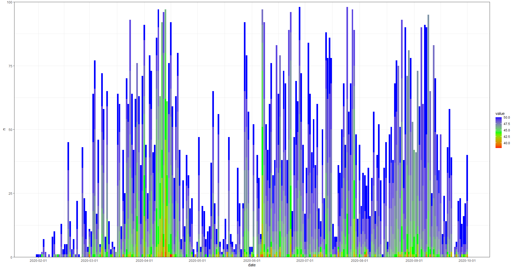

## Analyzing Apple Watch Heart Rate Data in R

The HR data collected by the Apple Watch can be analyzed in R after exporting from the Health app on the iPhone. The first part of the script extracts the HR data from the broader Health export file and prepares it for analysis.
